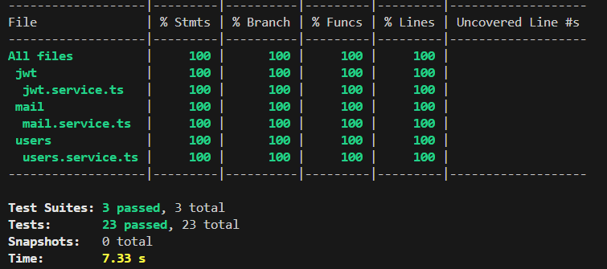

# [풀스택] 우버 이츠 클론코딩

3년 전에 [[풀스택] 우버 이츠 클론코딩](https://nomadcoders.co/nuber-eats/lobby) 강의를 수강했었다. 또한, [챌린지 5기](https://nomadcoders.co/community/thread/1290)도 완료!! (nanofe).

그 후 백엔드 개발을 하지 않아서 많은 것을 잊어버렸고, 백엔드 개발을 해야 할 기회가 생겨 재수강을 하면서 다시 정리를!!

## 학습 목표

처음에는 1강 부터 순서대로 끝까지 수강하려고 했으나 업무하면서 짬내서 스터기 시간 내기가 .... 생각보다 쉽지 않음 ㅠ.ㅜ;

내부 스터디에서 빠르게 테스트가 필요해서 11강까지 들은 후 deploy를 수강하면서 백엔드를 먼저 배포하고 16강 Frontend Setup ~ 18강 User Pages
으로 수강 후 다시 순서대로 수강하는 것으로 현 시점에서는 계획을 ...

## 학습 메모

### 2강 GRAPHQL API

버전 차이로 GraphQLModule driver가 추가 되었다.

### 3강 DATABASE CONFIGURATION

강의에서는 TypeORM + PostgreSQL을 사용했지만, MongoDB를 활용해보기 위해서 [Nest JS Mongo](https://docs.nestjs.com/techniques/mongodb)를 참고해서 적용했다.

TypeORM을 이용해서 MongoDB를 사용할 수 있지만, TypeORM이 주로 관계형 데이터베이트에 최적화 되어 있다고 알고 있어서 Mongoose를 택함.

### 5강 USER CRUD

bcrypt를 적용하는 과정에서 강의는 TypeORM을 사용하니 `@BeforeInsert`를 사용했지만, mongo에서 1. 스키마 파일에서 직접 정의, 2. 모듈에서 정의하는 방법 중 1번을 선택했다. 이유는 스키마와 관련된 모든 로직이 한 파일에 모여 있어 관리가 쉽다고 생각함.

```typescript
// 1. 스키마 파일에서 직접 정의 (user.entity.ts)
export const UserSchema = SchemaFactory.createForClass(User);

UserSchema.pre('save', async function (next) {
  if (!this.isModified('password')) {
    return next();
  }
  try {
    const salt = await bcrypt.genSalt();
    this.password = await bcrypt.hash(this.password, salt);
    return next();
  } catch (e) {
    return next(e);
  }
});

// 2. 모듈에서 정의 (users.module.ts)
@Module({
  imports: [
    MongooseModule.forFeatureAsync([
      {
        name: User.name,
        useFactory: () => {
          const schema = UserSchema;
          schema.pre('save', async function (next) {
            // ... 비밀번호 해싱 로직 ...
          });
          return schema;
        },
      },
    ]),
  ],
})
```

### 6강 USER AUTHENTICATION

#### NestJS에서 Middleware 사용하는 방법 (jwtMiddleWare예시)

1. bootstrap에 적용

```typescript
async function bootstrap() {
  // ...
  app.use(jwtMiddleware);
  // ...
}
```

2. AppModule에 적용

```typescript
export class AppModule implements NestModule {
  configure(consumer: MiddlewareConsumer) {
    // 함수(jwtMiddleware)나 Class(JwtMiddleware) 적용
    consumer.apply(jwtMiddleware).forRoutes({
      path: '*',
      method: RequestMethod.ALL,
    });
  }
}

// 함수
export function jwtMiddleware(req: Request, res: Response, next: NextFunction) {
  console.log(req.headers);
  next();
}

// Class
export class JwtMiddleware implements NestMiddleware {
  use(req: Request, res: Response, next: NextFunction) {
    console.log('req', req.headers);
    next();
  }
}
```

#### TypeORM BeforeInsert, BeforeUpdate 처리

`UserSchema.pre`를 이용

```typescript
// ./src/users/entities/user.entity.ts

// TypeORM BeforeInsert
UserSchema.pre('save', async function (next) {
  if (!this.isModified('password')) {
    return next();
  }
  try {
    this.password = await hashPassword(this.password);
    return next();
  } catch (e) {
    return next(e);
  }
});

// TypeORM BeforeUpdate
UserSchema.pre('findOneAndUpdate', async function (next) {
  const update = this.getUpdate() as UpdateQuery<User>;
  if (update.$set && update.$set.password) {
    try {
      update.$set.password = await hashPassword(update.$set.password);
    } catch (error) {
      return next(error);
    }
  }
  return next();
});
```

`16.15`강의에 있지만 BeforeUpdate 사용 시 password를 변환하지 않음. 그래서 TypeORM에서 postgresql 사용 시, update대신 findOne, save 사용.

### 7강 EMAIL VERIFICATION

typeorm에서는 JoinColumn을 사용하지만 mongoose에서는 Types.ObjectId를 사용함.

```typescript
  @Prop({ type: Types.ObjectId, ref: 'User' })
  @Field(() => User)
  user: User;
```

TypeORM의 onDelete: 'CASCADE'와 같은 기능은 Mongoose에서 자동으로 제공되지 않음.
만약 구현한다면, 다음과 같이 구현할 수 있음.

```typescript
// TypeORM onDelete: 'CASCADE' 와 비슷한 기능 구현 샘플
UserSchema.pre<Query<any, User>>('findOneAndDelete', async function (next) {
  try {
    const user = (await this.model.findOne(this.getFilter())) as User | null;
    if (user) {
      const VerificationModel: Model<Verification> = new this.model(
        'Verification',
      );
      await VerificationModel.deleteOne({ user: user.id });
    }
    next();
  } catch (error) {
    next(error instanceof Error ? error : new Error('Unknown error'));
  }
});
```

강의에서는 `Mailgun`을 사용해서 직접 구현했지만, 나는 [`mailersend`](https://www.mailersend.com/)를 적용해봄.

템플릿도 쉽게 적용할 수 있었음.

### 8강 UNIT TESTING THE USER SERVICE

강의와 코드가 다르다보니 테스트 코드에서 mocking 하는 부분이 조금 차이가 있었음.

### 9강 Unit Testing Jwt and Mail



### 10강 User Module E2E

`this.verifications`에서 삭제 관련 내용들을 수정했다.

제대로 삭제가 되지 않는 현상을 확인함. 이래서 test db로 직접 E2E 테스트를 하는 게 좋다고 생각함.
(프론트에서도 해야 하는데 ... ^^;;)

### 11강 Restaurant CRUD

개발 중 `MongoServerError: E11000 duplicate key error collection:`가 발생했다.

- 테이블도 지워보고, 코드도 변경해보고 ... 검색, GPT, Claude를 동원했지만, 해결하지 못했다.
- 결국 DB를 완전히 초기화(삭제후 생성)하니 해결되었다.
- 발생한 원인으로 개발하는 과정에서 `unique`를 넣었다 뺐다 하면서 발생했다고 생각한다.

`EntityRepository deprecated` 관련해서는 [강의 댓글](https://nomadcoders.co/nuber-eats/lectures/2115)에서 여러 케이스를 확인할 수 있다.
나는 TypeORM을 사용하지 않아서 `@Injectable()`을 이용해서 테스트를 진행했었다.

TypeORM에서 `ManyToOne, OneToMany`등 다양하게 관계를 맺었지만, 몽고에서는 단순하게 단방향으로 구성하고 `ResolveField`를 이용해서 역방향 관계를 구현할 수 했음.

추후 관련 데이터를 가져올때는 Mongoose의 `populate` 메서드를 사용.

`ResolveField`를 사용하는 것은 대부분의 경우 성능상 이점이 있을 수 있지만, 항상 그런 것은 아니므로 애플리케이션의 특성, 모델, 쿼리 패턴 등을 고려하여 결정해야 한다함. (by Claude)

- 대규모 중첩 쿼리의 경우 여러 번의 데이터베이스 호출이 발생할 수 있어 성능 저하가 일어날 수 있음.
- 때로는 단순히 모든 데이터를 한 번에 가져오는 것보다 구현이 복잡해질 수 있음.

```typescript
/* Restaurant entity */

// 강의 내용
  @Field(type => Category, { nullable: true })
  @ManyToOne(
    type => Category,
    category => category.restaurants,
    { nullable: true, onDelete: 'SET NULL', eager: true },
  )
  category: Category;

// 적용 코드
  @Field(() => Category, { nullable: true })
  @Prop({
    type: Types.ObjectId,
    ref: 'Category',
    required: false,
  })
  @IsOptional()
  category?: Types.ObjectId | Category;
```

#### TODO

시간이 여유가 조금 있을 때는 다음과 같은 작업을 해보려고 한다.

- `mongoose-migrate`같은 스키마 변경 이력 관리를 ...
